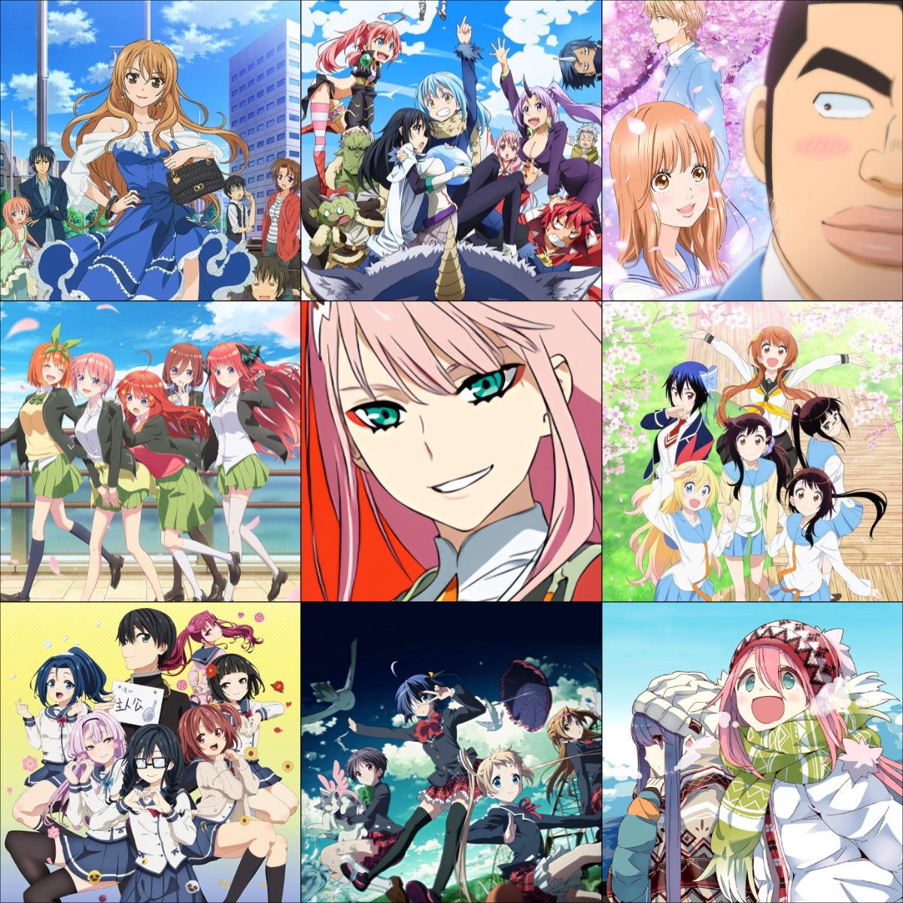

<br/>

<details>
  <summary>Facts</summary>
  
```
__________                    ___________                  
\____    /___________  ____   \__    ___/_  _  ______      
  /     // __ \_  __ \/  _ \    |    |  \ \/ \/ /  _ \     
 /     /\  ___/|  | \(  <_> )   |    |   \     (  <_> )    
/_______ \___  >__|   \____/    |____|    \/\_/ \____/     
        \/   \/                                            
__________                 __      ________.__       .__   
\______   \ ____   _______/  |_   /  _____/|__|______|  |  
 |    |  _// __ \ /  ___/\   __\ /   \  ___|  \_  __ \  |  
 |    |   \  ___/ \___ \  |  |   \    \_\  \  ||  | \/  |__
 |______  /\___  >____  > |__|    \______  /__||__|  |____/
        \/     \/     \/                 \/                
```
</details>


<details>
  <summary>My 3x3</summary>
  
  
  #TeamNino #TeamOnoderaNasaki #TeamHimawari
</details>

<details>
  <summary>Bio.ts</summary>
 
```
 _____________________________________
< Welcome to my github page! >
 ------------------------------------- 
⠀⠀⠀⠀⠀⠀⠀⠀⠀⠀⠀⠀⠀⠀⠀⠀⣀⣯⣾⣿⡿⢟⣿⠛⠉⠩⠁⠀⠀⡟⠁⠀⣀⠀⠀⠈⠙⠿⣿⣿⣿⣿⣿⣿⣿⣿⣦⠀⠀⠀⠀⠀⠀⠈⠢⣄⠀⠀⠀⠀⠀⠀⠀⠀⠀⠀⠀
⠀⠀⠀⠀⠀⠀⠀⠀⠀⠀⠀⠀⠀⣴⣾⡿⠟⠁⣐⡮⠁⠀⡐⠀⠀⠀⠀⢰⣅⠈⠀⠒⠄⡀⠀⠀⠀⠙⠿⣿⣿⣿⣿⣿⣿⣷⣄⠀⠀⠀⠀⠀⠀⠐⠆⠀⠀⠀⠀⠀⠀⠀⠀⠀⠀
⠀⠀⠀⠀⠀⠀⠀⠀⠀⠀⠀⢀⣰⡿⠋⠀⠀⠀⡬⠁⠀⡐⠀⠀⠀⠀⠀⠀⠟⢂⠀⠀⠀⠈⠂⡀⠀⠀⠀⠈⠙⢿⣿⣻⣿⣿⣿⣷⡀⠀⠀⠀⠀⠀⠈⢳⡀⠀⠀⠀⠀⠀⠀⠀⠀
⠀⠀⠀⠀⠀⠀⠀⠀⠀⠀⠀⣲⠏⠀⠀⠀⠠⡙⠀⠀⢀⠁⠀⠀⠀⠀⠀⠀⠐⡈⠑⡀⠀⠀⠀⠈⠢⡀⠀⠀⠀⠀⠙⣿⣿⣿⣿⣿⣷⡀⠀⠀⠀⠀⠀⠀⢗⠀⠀⠀⠀⠀⠀⠀⠀
⠀⠀⠀⠀⠀⠀⠀⠀⠀⢀⠬⠁⠀⢀⠈⠀⢠⠁⠀⠀⡈⠀⠀⠀⠀⠀⠀⠀⠀⠐⡀⠈⢄⠀⠀⠀⠀⠀⢄⠀⠀⠀⠀⠈⠻⣿⣿⣿⣿⣷⡀⠀⠀⠀⠀⠀⠈⠦⠀⠀⠀⠀⠀⠀⠀
⠀⠀⠀⠀⠀⠀⠀⠀⠀⡼⠁⠀⠀⠂⠀⠀⡄⠀⠀⠀⠁⠀⠀⠀⠀⠀⠀⠀⠀⠀⠀⠄⠈⢂⠀⠀⠀⠀⠀⢂⠀⠀⠀⠀⠀⠈⢿⣿⣿⣿⣗⡀⠀⠀⠀⠀⠀⠈⣇⠀⠀⠀⠀⠀⠀
⠀⠀⠀⠀⠀⠀⠀⠀⣨⠁⠀⠀⠄⠀⠀⢀⠀⠀⠀⢰⠀⠀⠀⠀⠀⠀⠀⠀⠀⠀⠀⠀⠀⠀⢂⠀⠀⠀⠀⠀⢂⠀⠀⠀⠀⠀⠀⢻⣿⣿⣿⡰⠀⠀⠀⠀⠀⠀⢩⠀⠀⠀⠀⠀⠀
⠀⠀⠀⠀⠀⠀⠀⢠⡇⠀⠀⡘⠀⠀⠀⢸⠀⠀⠀⢸⠀⠀⠀⠀⠀⠀⣣⠀⠀⠀⠀⠀⠀⠀⠀⢆⠀⠀⠀⠀⠀⠀⠀⠀⠀⠀⠀⠀⢿⣿⣿⡇⢃⠀⠀⠀⠀⠀⠸⢆⠀⠀⠀⠀⠀
⠀⠀⠀⠀⠀⠀⠀⣨⠀⠀⢀⠁⠀⠀⠀⠀⠀⠀⠀⣼⠀⠀⠀⠀⠀⠀⢁⢀⠀⠀⠀⠀⠀⠀⠀⠈⠄⠀⠀⠀⠀⠀⠀⠀⠀⠀⠀⠀⠈⣿⣿⡇⠋⡀⠀⠀⠀⠀⠀⣏⠀⠀⠀⠀⠀
⠀⠀⠀⠀⠀⠀⢠⡇⠀⠀⡈⠀⠀⠀⠀⠀⠀⠰⢰⣿⡆⠀⠀⠀⠀⠀⠀⠄⢂⠀⠐⡀⠀⠀⠀⠀⠈⠄⠀⠀⠀⠀⠀⠀⠀⠀⠀⠀⠀⠸⣿⣿⠈⢡⠀⠀⠀⠀⠀⢸⠀⠀⠀⠀⠀
⠀⠀⠀⠀⠀⠀⢨⠀⠀⢀⠁⠀⠀⠀⠀⢀⠀⠆⣿⣿⣧⠀⠠⠀⠐⠀⠀⠘⡀⠠⠀⠐⣀⠀⠀⠀⠀⠘⡄⠀⠀⠀⠀⠀⠀⠀⠀⠀⠀⠀⢻⣿⠀⠈⡄⠀⠀⠀⠀⠘⠆⠀⠀⠀⠀
⠀⠀⠀⠀⠀⠀⣿⠀⠀⠘⠀⠀⠀⠀⠀⠸⠰⢸⣿⣿⣿⣆⠀⢂⠀⠀⠀⠀⠐⡀⠐⠀⠐⠑⠀⠀⠈⠄⠐⡀⠀⠀⠀⠀⠀⠀⠀⠀⠀⠀⠘⣿⠀⠀⢁⠀⠀⠀⠀⠀⡆⠀⠀⠀⠀
⠀⠀⠀⠀⠀⠀⡊⠀⠀⡀⠀⠀⠀⠀⠀⢐⢳⣾⣿⣿⣿⣿⡌⠌⣆⠀⠀⠀⠀⠐⠀⠈⠂⠈⢀⠢⡀⠀⢂⢡⠀⠀⠀⠀⠀⠀⠀⠀⠀⠀⠀⢿⠀⠀⠘⠀⠀⠀⠀⠀⠣⠀⠀⠀⠀
⠀⠀⠀⠀⠀⠀⡅⠀⠀⡇⠀⡀⠀⠀⠀⢰⣧⣿⣿⣿⣿⣿⣿⣄⠚⢆⠀⠀⠀⠀⠈⢄⠀⠑⠀⠁⡀⠀⠀⠂⡆⠀⠀⠀⠀⠀⠀⠀⠀⠀⠀⢸⠀⠀⠀⡆⠀⠀⡆⡆⡔⠄⠀⠀⠀
⠀⠀⠀⠀⠀⠀⣿⠀⠃⢸⢀⡇⠀⠀⠠⠈⣻⣿⣿⣿⣿⣿⣿⣿⣦⠙⡧⡀⠀⠀⠀⠀⠀⡀⠀⠀⠈⠀⡀⢀⢲⠀⠀⠀⠀⠀⠀⠀⠀⠀⠄⢸⠆⠀⠀⡇⢰⠀⢳⠁⢷⠗⡀⠀⠀
⠀⠀⠀⠀⠀⠀⢹⢰⠀⠈⣸⢰⠀⠀⠀⠒⡹⣿⣿⣿⣿⣿⣿⢿⣿⣷⣜⣮⣦⠀⠀⠀⠀⠈⠊⠀⠀⠀⢄⠀⠀⡄⠀⠀⠀⠀⠀⠀⠀⠀⢤⢸⠀⠀⠀⡇⢸⢰⣾⢠⠆⠁⠀⠀⠀
⠀⠀⠀⠀⠀⠀⠸⢸⠆⠀⢡⢀⠃⠀⠀⢀⠱⡹⣿⣿⣿⣿⣯⣿⣼⣹⣻⣮⣿⣿⡦⡀⠐⠄⠀⠈⠢⡢⢀⠀⠠⡣⡀⠀⠀⠀⠀⠀⠀⠀⡿⢸⠀⠀⠀⡇⠸⢘⠙⣾⠀⠀⠀⠀⠀
⠀⠀⠀⠀⠀⠀⢸⣾⣯⣶⠀⢸⠎⠄⡀⠈⡷⣼⣌⢻⣿⣿⣿⠿⢻⠩⠁⠀⠈⠑⢖⠠⠔⢄⠀⢌⠐⠨⠢⠁⠣⠂⠰⢠⣄⠀⠀⠀⠀⢠⡙⡈⠀⠀⠀⣌⢀⢸⠀⠏⠀⠀⠀⠀⠀
⠀⠀⠀⠀⠀⠀⠀⢹⣁⠱⡇⢸⢰⡘⢇⢄⢡⠈⢿⣷⠟⠋⠀⠀⠀⢅⠀⠀⠀⠀⠀⠁⠀⠀⠈⠂⡝⡰⢠⠄⣐⡆⠀⢀⠀⠈⠀⠂⢠⢲⢡⠃⠀⠀⣰⠂⣸⡆⠘⠃⠀⠀⠀⠀⠀
⠀⠀⠀⠀⠀⠀⠀⠀⠙⠦⢩⣆⢼⢡⠈⠂⠱⢕⠌⡅⠀⢀⠀⠀⠀⠀⠁⠀⠀⠀⠀⠀⠀⠀⠀⠀⠈⠂⠁⠊⠔⣣⣀⣀⣀⠸⠀⣠⢏⡲⡉⠀⠠⢠⡏⢠⣗⠁⠀⠀⠀⠀⠀⠀⠀
⠀⠀⠀⠀⠀⠀⠀⠀⠀⠀⠀⢧⢯⣛⣥⠀⠀⠂⠈⠩⢊⠀⠀⠀⠀⠀⢀⡀⢀⠀⠀⠀⠀⠀⠀⠀⠀⠀⠀⢁⣵⠉⠁⠀⠄⡆⡊⣜⡚⡔⠀⢠⡵⣿⢠⠯⠂⠀⠀⠀⠀⠀⠀⠀⠀
⠀⠀⠀⠀⠀⠀⠀⠀⠀⠀⠀⠀⢊⡎⠙⢓⠄⠀⢆⠀⠑⠱⢄⠀⠀⠀⠁⢃⡀⠀⠉⠀⠀⠀⠀⠀⠀⢀⢐⠚⠹⠀⡀⣨⢰⡀⢨⡣⡞⣠⡰⠉⢀⣭⠃⠀⠀⠀⠀⠀⠀⠀⠀⠀⠀
⠀⠀⠀⠀⠀⠀⠀⠀⠀⠀⠀⠀⠘⢧⠤⠢⠽⠦⢈⠑⢦⢀⠳⡅⡠⡀⠀⠀⠀⠀⠀⠁⠀⠀⠀⡠⣐⠁⡂⢀⢃⣔⣔⣇⢛⢣⡜⣷⠮⡧⠃⠈⢐⠂⠀⠀⠀⠀⠀⠀⠀⠀⠀⠀⠀
⠀⠀⠀⠀⠀⠀⠀⠀⠀⠀⠀⠀⠀⠀⢣⡆⠀⢠⠈⠑⠊⣾⣺⢳⣿⠙⢲⣄⡀⠀⢀⣀⣤⡔⢻⡔⠃⠁⣀⡔⢹⡏⢹⣿⠁⠙⣷⣟⡆⠀⠀⠀⠀⠀⠀⠀⠀⠀⠀⠀⠀⠀⠀⠀⠀
⠀⠀⠀⠀⠀⠀⡄⣴⠾⠟⣴⢠⠀⠀⠀⠀⠀⠀⠀⠀⠀⠀⠉⠀⠟⠃⣿⣿⡅⠘⠈⠉⠉⠁⠀⠀⠀⠃⠛⠃⢸⣷⣼⡏⠀⠀⠈⠻⣦⠀⠀⠀⠀⠀⠀⠀⠀⠀⠀⠀⠀⠀⠀⠀⠀
⠀⠀⠀⣠⠤⢓⣵⣾⣿⣷⣄⠈⢘⠲⣠⠀⠀⠀⠀⠀⠀⠀⠀⠀⠀⠀⢻⣿⣿⣷⣶⣶⣶⣤⣤⣤⣤⣶⣶⣶⣿⣿⣿⠀⠀⠀⠀⠀⠀⠀⠀⠀⠀⠀⠀⠀⠀⠀⠀⠀⠀⠀⠀⠀⠀
⢀⡤⠓⠁⣰⡿⣽⢾⣟⣿⣿⣧⡄⡘⠢⡟⣧⣠⡀⠀⠀⢀⡀⣀⣴⣁⠟⠹⣿⣿⣿⣿⣿⣿⣿⣿⣿⣿⣿⣿⣿⣿⣅⠀⠀⠀⠀⠀⠀⠀⠀⠀⠀⠀⠀⠀⠀⠀⠀⠀⠀⠀⠀⠀⠀
⠟⠁⢀⣾⢯⣟⣽⣻⣞⡿⣿⣿⣿⣮⣳⣜⣻⣿⣷⠒⠊⠉⠁⣠⣴⣶⣦⣤⣙⣿⣿⣿⣿⣿⣿⣿⣿⣿⣿⣿⣿⣿⣿⣗⢀⠀⠀⠀⠀⠀⠀⠀⠀⠀⠀⠀⡠⢤⣤⣠⠀⠀⠀⠀⠀
⠀⡠⢟⣞⣯⣞⣷⣻⣾⣿⣿⣿⣿⣿⣿⣾⣷⣿⢿⣵⣤⣶⣿⣿⡿⣿⣿⣿⣿⣾⣽⣿⣿⣿⣿⣿⣿⣿⣿⣿⣿⣿⣿⣿⣷⡴⣠⠀⢀⣠⠠⠒⠒⠒⠒⠋⣰⣿⡿⣿⣷⣴⠀⠀⠀
⢀⠝⣸⣿⣶⣿⣿⣿⣿⣿⣿⣿⣿⣿⣿⣿⣿⣿⣿⣿⣿⣿⣿⢯⣟⣿⣿⣿⣿⣿⣿⣿⣿⣿⣿⣿⣿⣿⣿⣿⣿⣿⣿⣿⣿⣧⡐⣉⠯⣄⠀⠀⠀⠀⠀⣴⣿⢯⣿⢷⣿⣿⣷⡂⠀
⢈⢠⣿⣽⣻⣿⢿⣯⣿⣽⣯⣿⣿⣿⣿⣿⣿⣿⣿⣿⣿⣿⣿⣿⣯⣿⣿⣿⣿⣿⣿⣿⣿⣿⣿⣿⣿⣿⣿⣿⣿⣿⣿⣿⣿⣿⣿⣵⣫⡽⣷⠀⢀⣠⣾⡿⣯⣿⣾⣿⣿⣟⣿⣿⡄
⠀⣼⣷⣻⣿⣾⣿⣯⣿⣯⣿⢿⣿⣿⣿⣿⣿⣿⣿⣿⣿⣿⣟⣿⣿⣿⣿⣿⣿⣿⣿⣿⣿⣿⣿⣿⣿⣿⣿⣿⣿⣿⣿⣿⣿⣿⣿⣿⣷⣿⡽⣧⠛⠿⣿⣽⣿⣿⣿⣿⣿⣿⣿⣿⣿
⢠⣿⡽⣟⣷⣿⣿⣿⣷⣿⡿⣿⣯⣿⣿⣿⣿⣿⣿⣿⣿⣿⣿⣷⣯⢿⣿⣿⣿⣿⣿⣿⣿⣿⣿⣿⣿⣿⣿⢿⣿⣿⣿⣿⣿⣿⣿⣿⣿⣿⣿⣿⣿⣶⣬⣟⣯⣿⣿⣿⣿⣿⣿⣿⣿
```

 
</details>


```console
gojo-kun@github:~$ ./welcome.sh
```

 

```
gojo-kun@github
```

&nbsp; &nbsp; &nbsp; &nbsp; &nbsp;


```console
gojo-kun@github:~$ git commit -m "bug fix (probably)"
```
